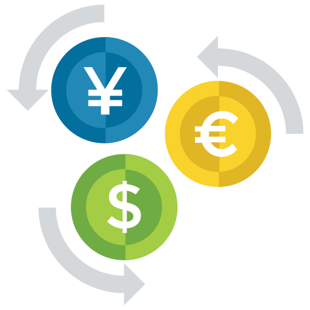
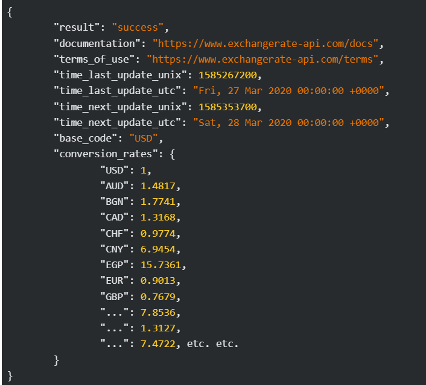

# Currency convertor



## Indice
- Descripcion del proyecto
- Explicación cada archivo de proyecto
- Dependencias
- Api usada


### Descripción del proyecto
```
    El proyecto consiste en un conversosr de monedas de cierta monedas en
    específico haciendo uso de una API de conversión la cual nos da de forma
    actualizada el valor de la moneda.
```

### Explicación de los archivos
```
    En el Proyecto tenemos 3 carpetas diferentes las cuales son [files], 
    [Models] y [Principal]
    
    En el carpeta [files] la estamos usando para guardar un archivo que 
    servirá como historial, al finalizar el programa se guarda un archivo
    tipo Json que conserva lo hecho por el usuario desde que inicializó el
    programa
    
    En la carpeta [Models] estamos guardando las Class y Records usados por
    el programa para hacer todas sus actividades, en esta carpeta tenemos
    diferentes archivos:
    ConsultApi: este archivo es usado para hacer la petición HTTP para que nos
    retorne el Json con el valor de la monedas que vamos usar.
    Currency: es un Record que usamos para almacenar el valor de la moneda que
    nececitamos previamente modificado el json con la libreria Gson para poder
    almancenar en este Record
    Converter: Esta clase la usamos como si fuera una clase calculadora, en esta
    almacenamos los valores de ambos datos, el valor a convertir y el valor de la
    moneda, también tenemos metodos para dibujar como se vería un registro del
    historial y hacer el calculo, también almacenamos el resultado.
    FileGenerator: Clase que usamos pra generar por medio de un metedo el archivo
    Json que usamos como Historial usando la librería Gson.
    
    En la carpeta [Principal] tenemos un solo archivo llamadao Principal, clase que
    usamos para hacer ejecución de cada archivo del programa(los archivos almacenados
    en Models), aparte de eso generamos un bucle que se va encargar de solicitarle
    al usuario que valor se necesita convertir y de que moneda a que moneda, se genera
    una lista que toma el valor que tenemos en la clase Converter y al final genera el 
    archivo History en [Files].
     
```

### Dependencias
```
    En este caso no tenemos si no solo una dependencia primordial para hacer uso
    del programa, esta es la librería Gson.
    
    Gson es una biblioteca de Java que permite convertir objetos Java a su 
    representación JSON y viceversa. Es desarrollada y mantenida por Google y es 
    ampliamente utilizada en aplicaciones Java para el procesamiento de datos JSON. 
    Gson es conocida por su facilidad de uso y flexibilidad en la serialización y
    deserialización de objetos Java.
    
    Y dentro del ambiente JAVA usamos otras dependencias como IOException para el
    manejo de excepciones, ArrayList para generar listas donde podamos guardar los
    datos llevados al Historial y Scanner que es usada para la interacción con el
    usuario y obtener los datos deseados por el usuario.
```

### Api usada
```
   La Api usada es una propuesta por el equipo de Alura Latam, dicha Api 
   es *Exchange Rate API* dicha API nos retorna un Json:
```

```
   De esta Api se hace uso del parametro conversion_rates el cual contiene el
   valor y el código de cada moneda.
```